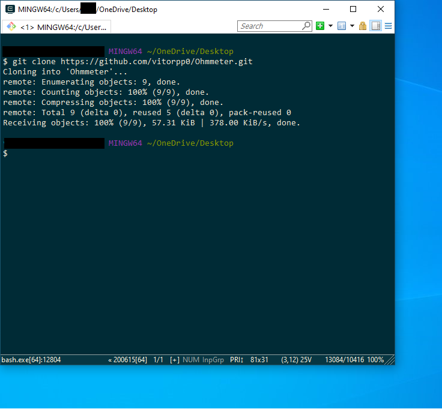
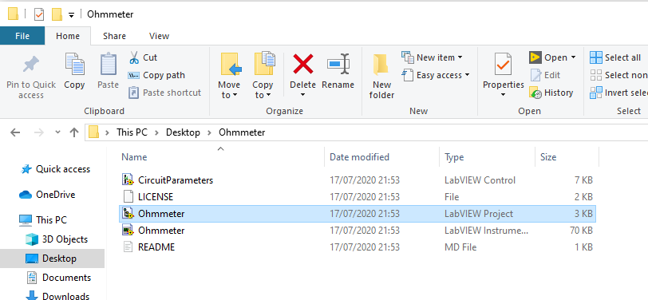
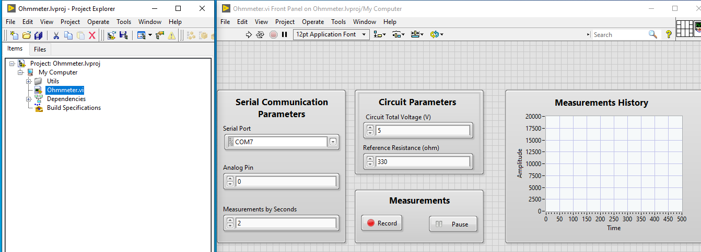
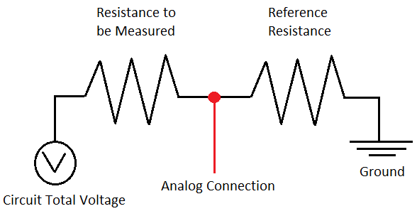

# Ohmmeter

An analog serial Arduino based ohmmeter developed in LabVIEW 2020

# Getting Started

First of all you must have LabVIEW installed in your machine, you can download it's commuty version 
in the <a href="https://www.ni.com/pt-br/shop/labview/select-edition/labview-community-edition.html">NI LabVIEW Community Edition</a> webpage. 

Once you have it chose a folder and run: git clone this/repository/url with your gitbash or other terminal as
ilustrated bellow.

After the cloning process, open the new folder and open the Ohmmeter.lvproj file. 

Then, select the Ohmmeter VI, fill the parameters fields and run the VI. 

Surprise! Nothing happens, thats because you need to click on the record button.

That wasn't so fast right? Now, one for the road: this VI was modeled to work with the model model circuit bellow.

