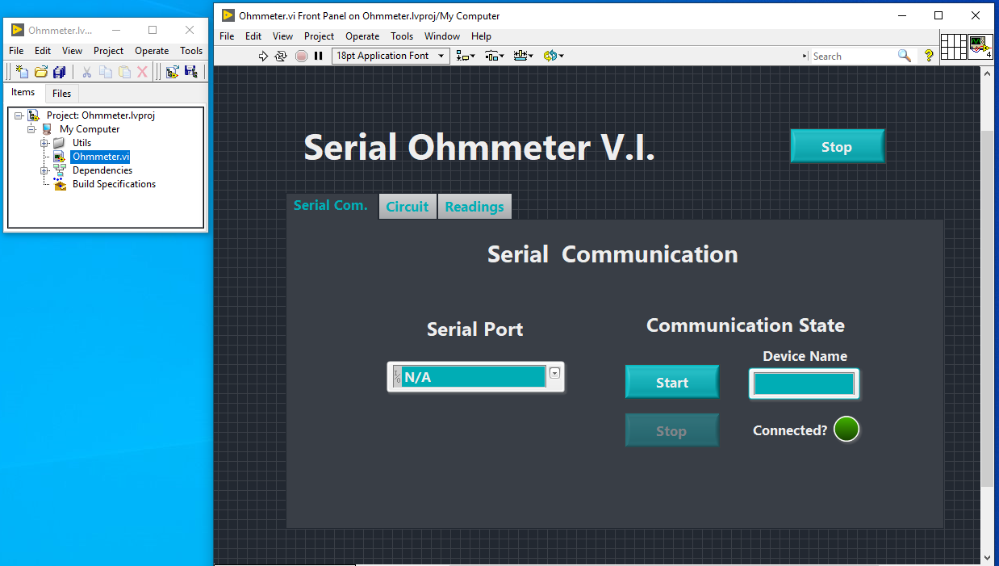

# Ohmmeter

An analog serial Arduino based ohmmeter developed in LabVIEW 2020

## Getting Started

### Install LabVIEW

First of all you must have LabVIEW installed in your machine, you can download its community version in the NI LabVIEW Community Edition [webpage](https://www.ni.com/pt-br/shop/labview/select-edition/labview-community-edition.html) for free. :star_struck:

### Prepare your Arduino

Well, as expected you must install a little NI program in your arduino to build the bridge between Arduinos C++ and the LabVIEW languages. 	:disappointed_relieved:
It's a quick process and well ilustrated in this nice [video](https://www.youtube.com/watch?v=RGRhIQneO6w). :sunglasses:


### Git Clone the Project

Ok! Now that we already did all of that it's time to clone the Ohmmeter project.  Choose a directory, open it in your gitbash and run the command:

```
git clone https://github.com/vitorpp0/Ohmmeter.git
```

After the cloning process open the Ohmmeter.lvproj and then the Ohmmeter.VI as illustrated below. 



## The Program

In the ohmmeter.VI click in RUN VI (the :arrow_right: icon) to start your application.

### Serial Communicatio Tab (Serial Com.)

In this tab you inform in which of your computer's port the aduino is connected with and start the serial communication between the LabVIEW and the microcontroller. 
To get everything done you must: 

-[x] Connect your Arduino to the computer via USB connection.
-[x] Select the connected port in the **Serial Port** dropdown menu.
-[x] Click on the **Start** button in the Communication State.
-[x] Wait for the **device's name** to appear and the **Connected?** light to turns on. 

Ok! Now your Arduino is connected with the ohmmeter.VI. :fireworks: :fireworks: :fireworks:

### Ohmmeter Circuit Tab (Circuit)

### Readings Tab
Now swicht to the **Readings** tab, set the frequency of your readings and click on **Read** button!
If you want to save the data as a .csv file, post processing :yum:, and the chart as a image, just pause the readings by clicking on the **Pause** button and press the **Save Data** button.

